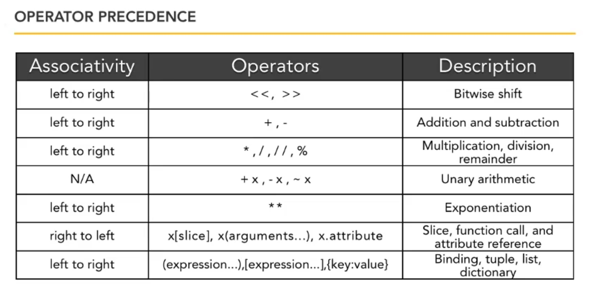
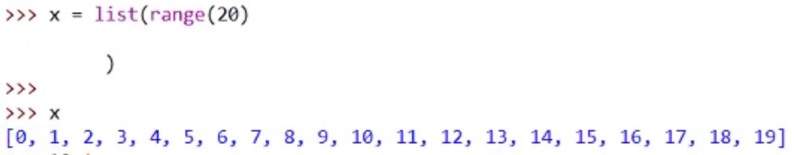
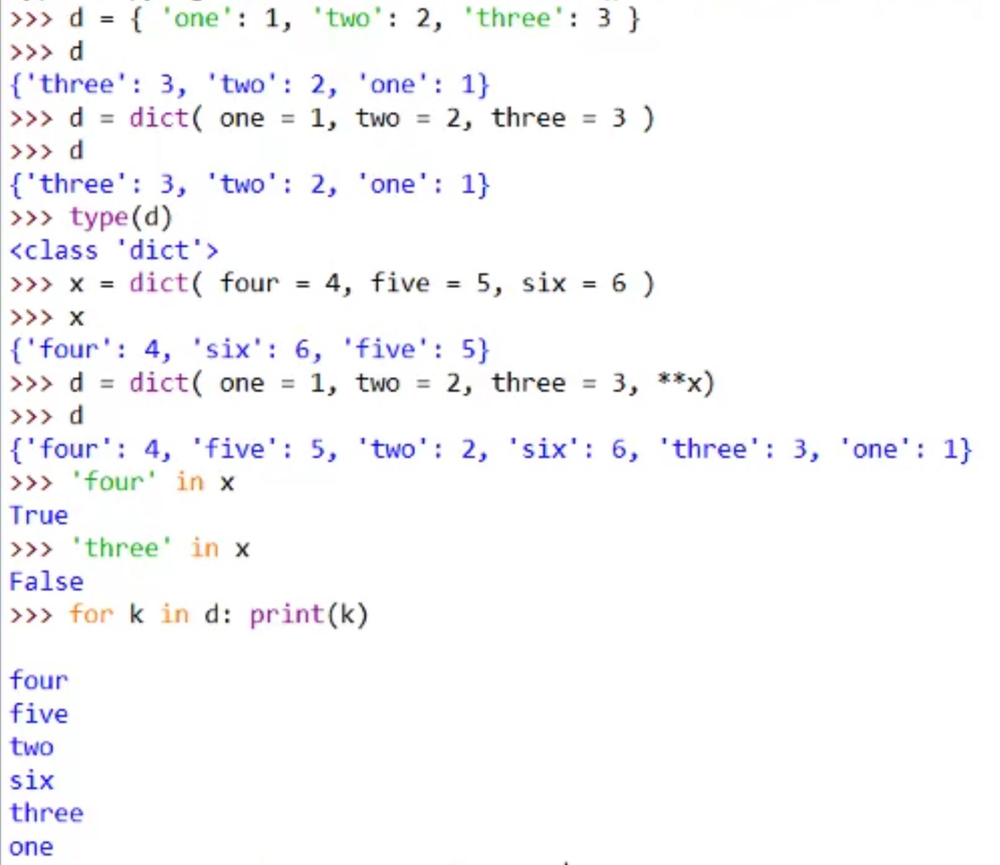
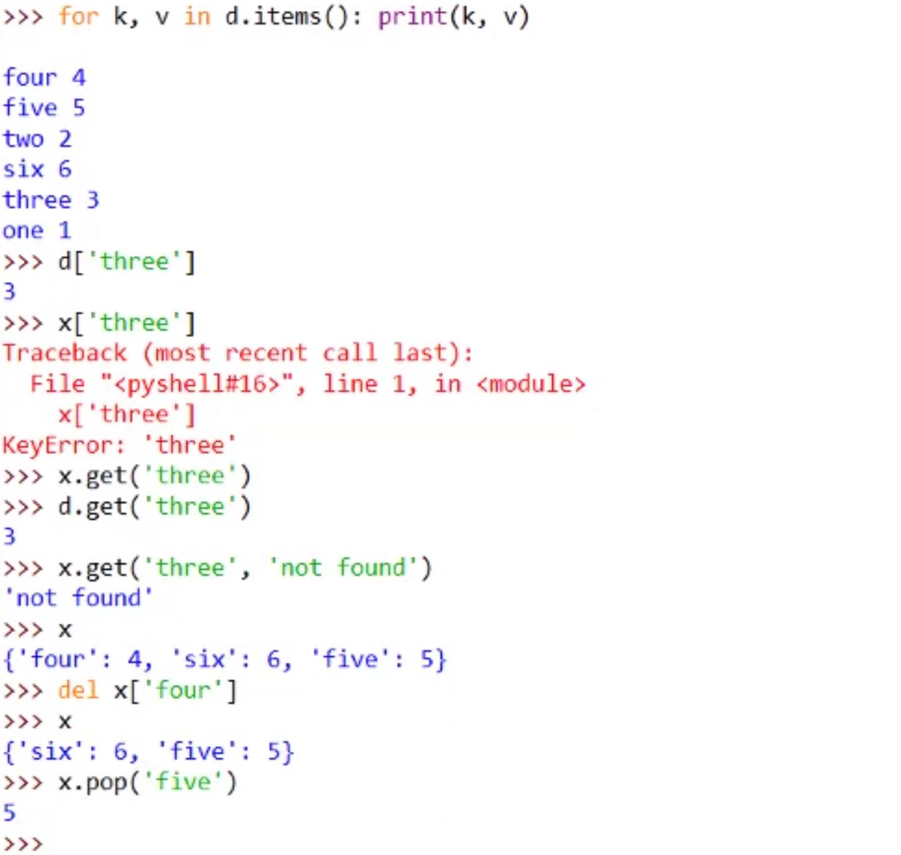
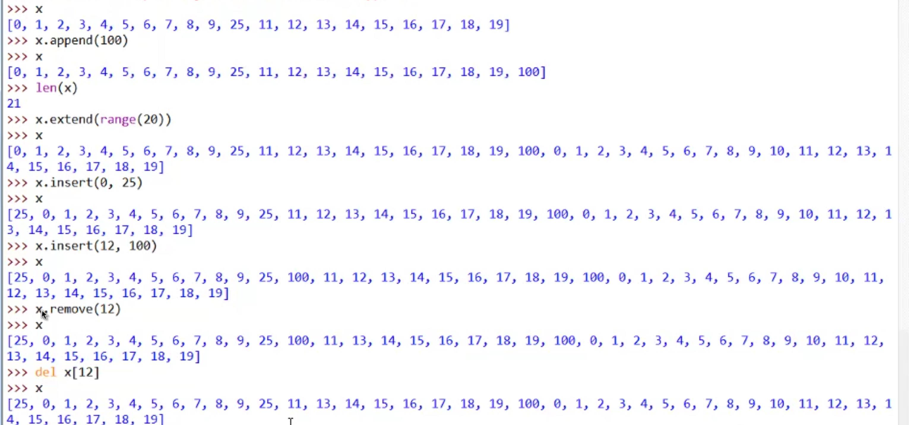

# MyPyhton3Training
This is Python3 Training Repo
###To build pyhon project refer- https://medium.com/@amimahloof/how-to-package-a-python-project-with-all-of-its-dependencies-for-offline-install-7eb240b27418

### decorators - 
https://gist.github.com/mhulse/4279705

https://www.programiz.com/python-programming/property

##### create List wih range

##### dictionary

##### List

